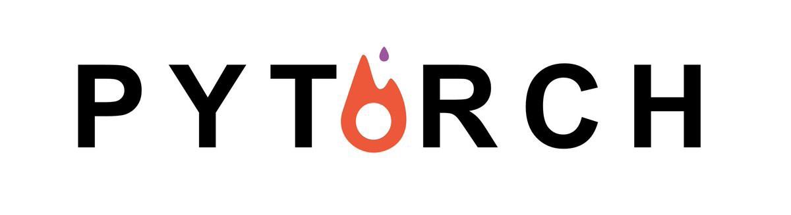

# PyTorch-Basic

This repository provides tutorial codes written in PyTorch for deep learning starters. Along with this repository, I recommend to read the [Official PyTorch Tutorial](https://pytorch.org/tutorials/). I tried to include as much essential information as possible. It will be keep updated as I study further and in depth. 

## Tables of Contents
### Basic
[0. Python Basic](https://github.com/hee9joon/PyTorch-Basic/blob/master/0.%20Python%20Basic.ipynb)
  [1. PyTorch Basic](https://github.com/hee9joon/PyTorch-Basic/blob/master/1.%20PyTorch%20Basic.ipynb)
  [2. Neural Networks](https://github.com/hee9joon/PyTorch-Basic/blob/master/2.%20Neural%20Networks.ipynb)

### Convolutional Neural Network
[3. Convolutional Neural Network](https://github.com/hee9joon/PyTorch-Basic/blob/master/3.%20Convolutional%20Neural%20Network.ipynb)
  [4. Transfer Learning and Custom Data](https://github.com/hee9joon/PyTorch-Basic/blob/master/4.%20Transfer%20Learning%20and%20Custom%20Dataset.ipynb)

### Recurrent Neural Network
[5. Recurrent Neural Network](https://github.com/hee9joon/PyTorch-Basic/blob/master/5.%20Recurrent%20Neural%20Network.ipynb)
  6. Sentiment Analysis

### Advanced Topics
[7. Neural Style Transfer](https://github.com/hee9joon/PyTorch-Basic/blob/master/7.%20Neural%20Style%20Transfer.ipynb)
  [8. Generative Adversarial Network](https://github.com/hee9joon/PyTorch-Basic/blob/master/8.%20Generative%20Adversarial%20Network.ipynb)
  9. Deep Q Learning (DQN)
